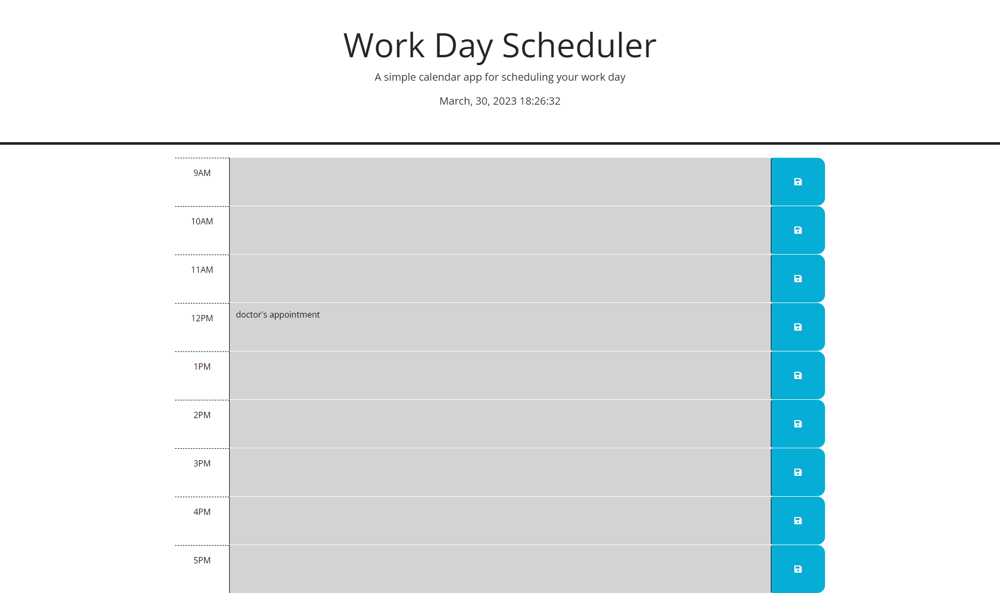

# work-day-scheduler

## Description 
I wanted to have a work day scheduler application so it would be simple and easy to track the hours from 9 am to 5 pm. It is easy to look at with the date and time. Along with color blocks that tell me where I am at in the current day. Grey for past, red for the current hour, and green for the future. Then I can write in appointments in a given block and local storage will keep that text in there for me to see all day. 

## Installation 
N/A

## Usage
To use the work day scheduler you will see the current date and time as the page loads and it will be color coded depending on what time of the day it is when you open the page. Feel free to type in the time blocks with to dos, notes, or appointments. 

The deployed page is here: https://tgold1.github.io/work-day-scheduler/

## Collaborators
N/A 

## License
N/A 

